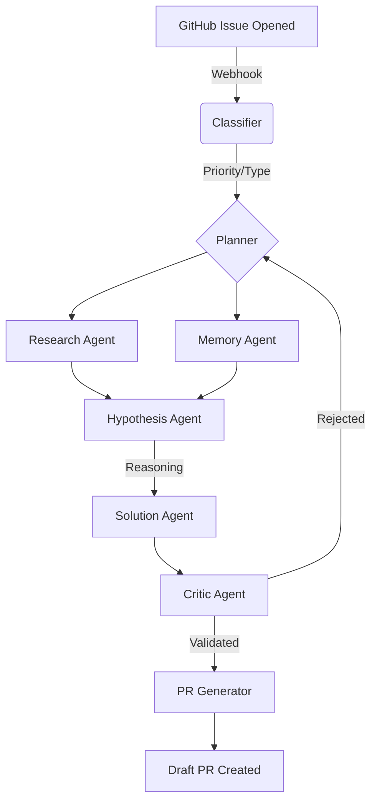

# 🛡️ SENTINEL: Autonomous Issue Resolver v4.0

<p align="center">
  
</p>

> **A self-evolving, multi-agent software engineering pipeline that investigates, reasons, validates, and resolves GitHub issues with minimal human oversight.**

[](https://omium.ai)
[](https://opensource.org/licenses/MIT)
[](https://www.python.org/)
[](https://fastapi.tiangolo.com/)

---

## 🌌 Overview

Most AI developer tools are **reactive**. They wait for a prompt, provide a snippet, and stop. **Sentinel** is **proactive**. It watches your repository, plans its own investigation, searches for context, generates competing hypotheses, and validates its own fixes before even suggesting them to a human.

It's not just a chatbot; it's a **digital teammate** that works while you sleep.

---

## 🧠 The Multi-Agent Swarm

Sentinel operates using a hierarchical swarm of specialized agents, coordinated via an **Async Orchestrator**. This allows for parallel execution of non-dependent tasks while maintaining strict logical reasoning.

| Agent | Responsibility | Technology |
| :--- | :--- | :--- |
| **🧠 Planner** | **The Strategist**. Analyzes the issue body and generates a custom investigation plan. | CoT Reasoning / LLM |
| **🔍 Research** | **The Librarian**. Performs semantic code searches across the repository. | ChromaDB / RAG |
| **💡 Hypothesis** | **The Scientist**. Generates competing root-cause theories with confidence scores. | Evidence Matching |
| **🛠️ Solution** | **The Engineer**. Synthesizes the best hypothesis into concrete code changes (diffs). | LLM (Gemini/OpenAI) |
| **⚖️ Critic** | **The Judge**. Evaluates solutions for relevance, calibration, and consistency. | Validation Logic |
| **💾 Memory** | **The Learner**. Stores patterns from past successes and failures for future reference. | Vector Memory |
| **📢 PR Gen** | **The Communicator**. Drafts Pull Requests and interacts with the GitHub API. | GitHub REST API |

---

## ⚡ How It Works (The Lifecycle)



1.  **Trigger**: A GitHub Webhook notifies Sentinel of a new issue.
2.  **Triaging**: The **Classifier** determines the severity and category (Bug, Feature, etc.).
3.  **Planning**: The **Planner** creates a step-by-step strategy for the investigation.
4.  **Discovery**: The **Research** & **Memory** agents retrieve relevant code and historical context.
5.  **Reasoning**: The **Hypothesis** agent tests theories against the codebase.
6.  **Synthesis**: The **Solution** agent generates a targeted fix.
7.  **Validation**: The **Critic** agent evaluates the fix. If it fails, the loop restarts.
8.  **Execution**: High-confidence fixes are posted as **Draft PRs** or detailed comments.

---

## 🚀 Getting Started

Follow these steps to set up Sentinel on your local machine.

### 📋 Prerequisites

- **Python 3.9+** installed.
- A **GitHub Personal Access Token (PAT)** with `repo` permissions.
- An **OpenAI** or **Gemini** API Key (Sentinel supports multiple providers).
- An **Omium API Key** for full observability.

### 1. Installation

Clone the repository and set up a virtual environment:

```bash
git clone https://github.com/reak-projects/anvil-hackathon.git
cd anvil-hackathon
python -m venv venv
# On Windows:
venv\Scripts\activate
# On Linux/macOS:
source venv/bin/activate

pip install -r requirements.txt
```

### 2. Configuration

Create a `.env` file in the root directory and add your credentials:

```env
# GitHub Configuration
GITHUB_TOKEN=your_github_personal_access_token
GITHUB_WEBHOOK_SECRET=your_optional_webhook_secret

# LLM Provider Configuration
OPENAI_API_KEY=your_llm_api_key
OPENAI_BASE_URL=https://api.openai.com/v1 # Or Groq/Gemini endpoints
LLM_MODEL=gpt-4-turbo # Or gemini-1.5-pro, llama3-70b-8192

# Observability
OMIUM_API_KEY=your_omium_api_key

# Server Settings
PORT=8000
HOST=0.0.0.0
```

### 3. Running the Application

Sentinel runs as a FastAPI server. Start it using the following command:

```bash
# Set PYTHONPATH to include the src directory
$env:PYTHONPATH="src" # Windows PowerShell
# OR
export PYTHONPATH=src # Linux/macOS

uvicorn src.main:app --reload
```

The server will be available at `http://localhost:8000`.

---

## 🖥️ Intelligence Center (The Dashboard)

Sentinel comes with a built-in **Intelligence Center** (`index.html`). This dashboard allows you to:
- Monitor live agent status.
- Trigger manual simulations for testing.
- View real-time traces of the agent's thought process.

To view it, simply open `index.html` in your browser while the server is running.

---

## 📊 Observability with Omium

Sentinel is fully instrumented with the **Omium SDK**, providing unprecedented visibility into autonomous operations:
- **Causal Threading**: See exactly how an issue led to a specific code change.
- **Agent Reasoning**: Trace the internal dialogue and logic of every agent.
- **Latency & Cost**: Monitor token usage and execution times in real-time.

Visit your [Omium Dashboard](https://omium.ai) to see the live traces.

---

## 🛠️ Technology Stack

- **Framework**: [FastAPI](https://fastapi.tiangolo.com/) (Async orchestration)
- **Observability**: [Omium SDK](https://omium.ai)
- **Vector DB**: [ChromaDB](https://www.trychroma.com/) (Semantic code search)
- **Embeddings**: [Sentence-Transformers](https://www.sbert.net/) (Local indexing)
- **Agent Logic**: Custom Hierarchical Multi-Agent System
- **LLMs**: Gemini 1.5, GPT-4, Llama 3 (via Groq)

---

## 🤝 Contributing

We welcome contributions! Whether it's a bug fix, a new agent idea, or documentation improvements.

1. Fork the repo.
2. Create your feature branch (`git checkout -b feature/AmazingFeature`).
3. Commit your changes (`git commit -m 'Add some AmazingFeature'`).
4. Push to the branch (`git push origin feature/AmazingFeature`).
5. Open a Pull Request.

---

## 🛡️ License

Distributed under the MIT License. See `LICENSE` for more information.

---
